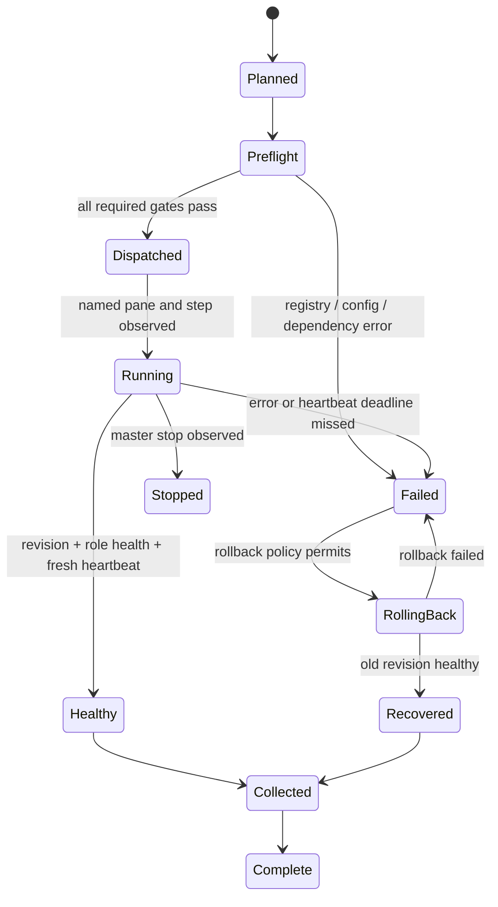

# Single-seat automatic recovery for client, relay, and worker

**Status:** partial per-host MVP implemented. This is not a fleet coordinator. The laptop must select targets, resolve and pin a full SHA, dispatch each step, enforce deadlines, collect evidence, and make the final verdict.

Implemented scripts: `setup/redeploy-watch.sh` applies one pinned SHA to a clean managed checkout, records an atomic local result under `.git/tcpuxdo-redeploy/`, and performs a role restart/health check with rollback; it rejects modified, staged, and non-ignored untracked files. `setup/worker-health.sh` checks fresh relay registration and the worker's eight-character SHA metadata; `setup/relay-health.sh` checks queue RPC; `setup/watchdog.sh` restarts a dead worker from a separate pane; restart scripts require a unique exact pane title. `setup/redeploy-selfcheck.sh` and `setup/worker-health-selfcheck.sh` are offline validation. Client behavior is one-shot and invocation-oriented. Relay deployment remains laptop-initiated. Worker rollout remains a laptop-issued ordinary relay-poll `send-keys` step; the queue itself has no typed run-contract/result protocol.

Not implemented: durable master run journal/coordinator, target registry, run IDs/idempotency records across hosts, worker-side update-contract polling, structured result transport, stop RPC, automatic fleet rollback policy, relay revision endpoint, process/pane identity journal, retry scheduling, or cross-host evidence collection. A relay queue acknowledgement means the keystroke operation ran; it does not mean the update completed.

## Purpose

Keep the tcpuxdo control path alive and updated across the laptop (client), relay, and polling workers, while keeping all decisions on the laptop. Remote machines are dumb executors: they run a reviewed program at a declared revision, report evidence, and do not choose targets, branches, or success criteria.

This is the minimalist tmux approach: tracked shell programs, named panes, Git fast-forward updates, targeted tmux respawn, and the existing relay for targets that cannot accept inbound connections. Avoid introducing a general-purpose deploy daemon unless the shell implementation proves inadequate.

The design below records the intended future coordinator. It is not implemented except where the per-host MVP is explicitly described later.

## Decisions (future design)

1. **Desired version is master-owned.** A laptop run record names repository, branch, full commit SHA, target registry name, component role, and step. A remote loop may poll and execute that contract, but must not independently decide to follow “latest”. If unattended branch tracking is explicitly configured for a box, that branch name is configuration owned and distributed by master tooling.
2. **Deploy immutable revisions.** A moving branch is only a discovery mechanism. Resolve it once to a full SHA on the laptop; each target fetches and checks out that SHA. Report the observed SHA. This avoids different nodes pulling different commits in one rollout.
3. **One supervisor pane, one component pane.** Never make a watcher respawn its own pane. A uniquely titled supervisor runs the update/check loop; a separate uniquely titled client, relay server, or worker pane is the managed child. The supervisor invokes the role-specific restart program.
4. **Update, restart, verify, then commit success.** Use fast-forward-only update, capture the old SHA, restart the intended component, and require a role-appropriate health result by deadline. On failure, restore the old SHA and restart it; report rollback separately. Never call queued/started equivalent to healthy.
5. **Every remote action is a tracked program.** Dispatch a repo script plus run ID, target name, pinned SHA, config reference, and step ID. No multiline shell blobs as the durable interface.
6. **Re-dispatch is recovery.** Each operation is idempotent under duplicate delivery, has a lock/idempotency key, and leaves a completion record including exit code. A partial run has no success sentinel.
7. **Evidence flows back to master.** Every target returns status, heartbeats, logs, and final revision to the laptop run folder. State that only exists in tmux scrollback or on the node is not a completed result.

## Roles and ownership

| Role | Managed process | Reachability | Master-side proof of healthy |
|---|---|---|---|
| Client | local CLI/cockpit process or local service | local execution initiated by master | local process/pane evidence, local doctor, configured relay reachable |
| Relay | queue server and admin service | registry-resolved push deploy or declared relay control path | queue RPC succeeds, relay process revision is known, workers continue registering |
| Worker | per-node `worker.py` polling loop | relay queue; node never needs inbound SSH | fresh relay heartbeat and observed worker revision, plus worker pane/process evidence |

The relay remains a dumb queue. It validates/enqueues and carries results; it does not schedule fleet updates or decide when a rollout passes. Each node polls. The laptop owns target selection, desired SHA, deadlines, retries, stop, rollback policy, and final verdict.

## Master-run contract (future design)

The future laptop verb should be one orchestrator entrypoint with role-specific adapters, for example:

```text
tcx-recover start --target-registry fleet.yaml --ref feat/worker-recovery
tcx-recover status <run-id>
tcx-recover stop <run-id>
tcx-recover collect <run-id>
```

These are proposed names. A run starts in a fresh directory outside the development checkout, e.g. `~/runs/tcpuxdo-recovery/<run-id>/`. It contains the resolved target list, immutable SHA, sanitized config, step records, heartbeat timestamps, logs, health observations, rollback observations, and collected result manifest. No `.env`, admin token, SSH private key, or provider secret is copied into the run folder.

Master state machine:



`UNDECIDED` is allowed while within a deadline. After the deadline, silence becomes `FAILED: stale heartbeat`, never `RUNNING`. A probe error is `ERR`, not a numeric zero or pass. Every status names the decider, target, pane title and resolved pane ID, evidence source, observation time, and deadline.

## Registry and run contract (future design)

Tracked registry entries use logical names and transport adapters, never remembered IPs in step commands. Each entry specifies role, repository identity, bootstrap program, transport (`local`, `push`, or `relay-poll`), worker ID when applicable, component pane titles, supported restart/health/rollback programs, heartbeat interval/deadline, and environment/profile identifier. Address lookup belongs to the adapter and happens at dispatch time. Duplicate registry names or ambiguous pane titles fail closed.

Before any remote dispatch, the master validates the complete run contract: selected ref resolves to a full SHA; target exists and role supports requested step; run config schema is complete; target is fresh/reachable; pane title resolves uniquely or creation is planned; tracked script exists at that SHA; repo tree used for staging is clean. Failure of any required check prevents dispatch for that target. A billable or destructive target creation must be downstream of all config/preflight gates.

Every step has a stable idempotency key `(run_id, target_name, component, step_name, sha)`. The node writes `started` then `complete` records atomically under its run directory; only `complete` plus exit status zero is eligible for health evaluation. Re-delivery returns the existing result if the same key already completed. A conflicting payload for the same key is a hard error. Partial artifacts remain visibly partial and are not mistaken for success.

## Pane and process conventions (future design; current worker-watch pane only restarts a dead worker)

- Pane titles are globally unique within a target role and encode component/concern, e.g. `tcpuxdo-worker-main`, `tcpuxdo-worker-watch`, `tcpuxdo-relay-server`, `tcpuxdo-relay-watch`, `tcpuxdo-client-watch`.
- Resolve titles to exactly one live pane at action time. Titles are selectors; record the resolved tmux server identity, pane ID (`%N`), pane PID, session, and title. Do not persist a bare `session:window.index` as the durable identity.
- The watcher pane never restarts itself. It invokes a tracked restart script that targets the component pane. It must survive component process death and restart.
- Long-running operation output is captured from its named pane with a bounded capture and timestamp. The updater also writes an append-only, size-rotated log and status record; capture is not the only evidence.
- Stop is issued from master via the same transport and checked against the exact run ID/process identity. Killing a tmux client/attachment is not equivalent to stopping the managed process.

## Proposed minimal updater loop (future design; not installed or started)

The remote `watch` program should be deliberately boring:

1. Acquire a nonblocking role lock. If another updater owns it, report `already-running` and exit successfully without starting a duplicate.
2. Read a validated, master-written run contract: target role, branch/ref, pinned SHA, run ID, health deadline, and tracked restart/check commands. Never source arbitrary generated shell.
3. Verify expected repository path, clean worktree, origin identity, and current component pane/title. If any differ, report failure and do not pull.
4. Fetch the requested ref. Compare the resolved SHA to the requested SHA. If the node has the requested commit already and health passes, return idempotent success. If it lacks the commit, fetch it; do not substitute a newer tip.
5. Save old SHA. Fast-forward/check out the exact requested SHA only. Refuse local modifications and history divergence.
6. Run the tracked role restart program against the separate component pane. Record operation ID and pane identity. Do not report success merely because `tmux respawn-pane` returned zero.
7. Probe role health until success or deadline. Worker: new heartbeat observed via relay within deadline and worker metadata reports target SHA. Relay: queue probe succeeds and server revision matches. Client: CLI/cockpit process is alive and local doctor/relay probe passes.
8. On success, atomically write completion sentinel and return a structured result to master. On failure, attempt the declared rollback to old SHA, restart, and verify old health. Return both new-version and rollback verdicts. Do not hide a failed rollback.
9. If the watcher loop itself runs continuously, emit a heartbeat on every cycle with timestamp, last successful check, current SHA, desired SHA/run, and last error. Missed watcher heartbeat also fails at master deadline.
10. Sleep with bounded jitter/backoff after transient fetch/network errors. Do not tight-loop, and do not lengthen the master’s declared liveness deadline implicitly.

Use `git fetch` plus explicit SHA checkout for a master-pinned rollout. `git pull --ff-only` is acceptable only for a deliberately configured self-tracking channel whose desired branch is itself part of the run contract; record the resolved SHA before restart. This distinction avoids “latest” moving during a multi-node rollout.

## Role-specific notes

### Client (future design beyond one-shot pinned update)

The laptop is the authority and should not depend on a remote worker to update its own control plane. The client updater is launched by a local tmux supervisor or existing local service; it updates a clean dedicated checkout, verifies the expected SHA, and restarts the client/cockpit process if one is managed. Do not restart the only orchestration process midway through its own run: the supervisor must be a stable bootstrap pinned separately, and the run journal must be durable before client replacement. A client restart must resume/reconcile the run ID from that journal. Local CLI-only usage may need no always-on pane; in that case updates occur as a master-invoked one-shot check instead of a permanent loop.

### Relay (future design beyond laptop-initiated update)

The relay process is not the control plane. Its watch pane may poll an authorized desired revision and restart only the queue/admin component panes. For the existing push deploy path, laptop may stage the exact reviewed files at the pinned SHA, but should execute the tracked deploy script and collect relay results. Ensure restart order does not drop result collection: persist the operation result/journal before respawning the server, and let the laptop observe health independently after the listener returns. Relay watchdog failures report through a channel the laptop can still observe (repeated queue health failure is a master-side timeout if relay itself cannot report).

### Worker (future design beyond watchdog restart and laptop dispatch)

Worker updater is separate from `worker.py`: the worker pane is expected to be busy, so master cannot type an update command into it. A dedicated watcher/control pane polls for its run contract through the relay, fetches the pinned code, respawns only `tcpuxdo-worker-main`, and waits for the worker's fresh registration/heartbeat. The relay may show a worker absent during restart; model that as `RESTARTING` only within the declared deadline. Do not interpret a queued restart op as executed. Worker bootstrap should recreate the watcher and worker from the tracked bootstrap on a fresh node; no manual SSH repair is a supported state.

## Minimal technology choices

**Preferred first implementation:** Bash scripts + tmux + Git + existing tcpuxdo relay protocol + local run-folder files. Use systemd only as a boot/crash supervisor on hosts where it already exists; tmux remains the visible pane/process boundary and master-facing evidence surface. Avoid a new Go daemon, webhook receiver, Docker layer, or general deployment product for this requirement.

Go becomes justified if the shell implementation needs robust framed RPC, concurrent fleet orchestration, structured durable state, portable locking, or stronger recovery semantics than shell can maintain. Even then, keep the tracked per-role step programs and tmux pane contract; a Go binary must not move agency onto relay/nodes.

Do not install a generic GitHub project just because it supports “pull and restart”: common webhook deployers assume inbound HTTP reachability and single-host service semantics, while this fleet includes NATed poll-only nodes and requires laptop-owned dispatch, deadlines, stop, collection, and per-pane evidence. A small referenced project may still be useful after comparison:

- [Git-Auto-Deploy](https://github.com/olipo186/Git-Auto-Deploy) is webhook-based automatic deployment; its inbound hook model does not directly fit nodes reachable only by polling.
- [rec-deploy](https://github.com/rdcstarr/rec-deploy) offers a broader CLI/webhook deployment tool and lifecycle than this minimal tmux watcher.
- [tmuxctl](https://github.com/alexeygrigorev/tmuxctl) is relevant to tmux control but does not define this Git update, pinned revision, health, rollback, and master collection contract.

These are comparison candidates, not dependencies or endorsements. Recheck maintenance, license, security posture, and current behavior before adopting any external code.

## Future rollout and acceptance gates

1. Add tests and a local fake-tmux integration harness; never test destructive restart against a live worker/relay.
2. Exercise the updater twice on the same SHA (idempotent no-op), then with a new SHA, fetch failure, dirty tree, diverged branch, restart failure, stale heartbeat, and rollback failure.
3. Test a target disappearing mid-run. Master status must fail at deadline, preserve evidence, and allow idempotent re-dispatch to a fresh registry target without remembered node state.
4. Test stop from laptop and verify the exact process exits; then status must show stopped. A detached process that survives stop fails acceptance.
5. Test collection before any target teardown. Reproduce reported SHA/health from the laptop's run folder alone.
6. Canary one disposable worker, then relay, then other workers in bounded batches, then client. Master pins one SHA for the whole rollout; no automatic fleet-wide update until canary gates pass.

## Implemented laptop-driven rollout

### First adoption on an existing node

An existing node with the older `setup/redeploy-watch.sh` does not understand `REDEPLOY_SHA`; sending it the new command cannot bootstrap itself. First merge this reviewed feature into the default branch that the node's existing checkout already tracks. Then run the current tracked laptop wrapper in explicit adoption mode:

```bash
./setup/node-redeploy.sh --adopt-default "$DEFAULT_BRANCH" \
  "$WORKER_NAME" "$WORKER_CONTROL_PANE" '~/tcpuxdo'
```

The wrapper dispatches only `REDEPLOY_BRANCH='<branch>' bash <repo>/setup/redeploy-watch.sh` through relay polling. The old tracked watcher resolves that branch, performs its legacy fast-forward pull, and restarts the worker through its own role path. Before dispatch, master must require fresh worker metadata showing the expected branch and `dirty == false`; worker metadata derives dirtiness from `git status --porcelain`. This is a one-time bootstrap bridge, not a pinned deployment. Only after relay state reports the adopted worker revision should master switch to the pinned command below. If the legacy watcher is absent or branch/cleanliness evidence is missing or mismatched, stop and use a separately reviewed preinstalled tracked bootstrap; do not send new variables to an old script or type into the worker pane.

This adoption step is the MVP's bootstrap mechanism. It requires the feature to be merged into the node's already-tracked default channel first; direct first-time rollout of an arbitrary feature-branch SHA to old nodes is unsupported. No manual SSH or typing into a node pane is required when the registry worker and idle control pane are reachable; master performs the one-time adoption dispatch. There is no unattended Git update. The watchdog only restarts a dead worker; bootstrap does not start `redeploy-loop.sh`.

This sequence uses a dedicated clean checkout on each host, a selected registry name, and the existing relay polling queue for workers. Resolve `REF` exactly once on the laptop and use that same full SHA everywhere:

```bash
REF='reviewed-branch-or-tag'
git fetch origin "$REF"
SHA="$(git rev-parse "origin/$REF^{commit}")"
[[ "$SHA" =~ ^[0-9a-f]{40}$ ]]
```

For an adopted worker (current checkout already contains the updater), first confirm its name and titled idle control pane from `tcpuxdo --op state`; then dispatch the tracked updater through the relay. The code update uses `REDEPLOY_SHA`, and the worker is restarted by the script in its separate main pane. `node-redeploy.sh WORKER CONTROL_PANE '~/tcpuxdo' FULL_SHA` is the wrapper form; it preserves the home-relative path for expansion by the worker shell:

```bash
./tcpuxdo -w "$WORKER_NAME" -p "$WORKER_CONTROL_PANE" \
  -c "cd '$WORKER_REPO' && REDEPLOY_ROLE=worker REDEPLOY_SHA='$SHA' bash setup/redeploy-watch.sh"
```

Wait for execution evidence by inspecting the worker's updater result file and relay `state.meta.sha`; require a fresh eight-character `meta.sha` equal to `git rev-parse --short=8 "$SHA"`. `send-keys queued` is not completion. The current interface does not return the local result file through relay, so absent independent evidence means `UNDECIDED` until the laptop deadline, then failed. For a relay, use the registry-resolved push transport and invoke the same tracked script with `REDEPLOY_ROLE=relay REDEPLOY_SHA=$SHA`; independently probe queue RPC and require an operator-verified relay checkout SHA. For the client, invoke it locally with `REDEPLOY_ROLE=client REDEPLOY_SHA=$SHA` in its clean deployment checkout; CLI-only mode requires no watcher pane. The worker watchdog only restarts a dead process; `setup/redeploy-loop.sh` is not installed or configured, and no unattended Git updates occur.

Run `bash setup/redeploy-selfcheck.sh`, `bash setup/worker-health-selfcheck.sh`, and `bash -n` on changed shell programs before dispatch. Roll only one disposable canary at a time. Stop dispatching on any failed health gate; rollback is a new laptop-authorized operation to the recorded old SHA. These steps are per-host adapters, not automated batching, stop, or durable master orchestration. `setup/watchdog.sh` only restarts a dead worker process; it does not fetch or apply Git updates. No unattended Git update loop is installed or started.

## Future work

- Does client need a permanent updater pane, or should the laptop run one-shot checks when the CLI starts?
- Which checked-in registry format and existing target-name resolver should be authoritative?
- Should unattended nodes follow a release channel or only update when master dispatches a pinned SHA?
- Which transports are supported for relay restart without losing the reporting channel?
- What exact heartbeat deadlines and retry/backoff policy fit current worker poll/sync intervals?
- Where is the master run journal stored and how are logs/artifacts retained or pruned?
- Which external projects, if any, pass license/security review and materially reduce maintained code?
