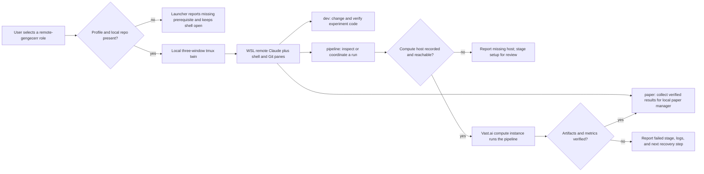

# Gen-GEC-ERR remote twin roles

All three launchers use the same three-window local tmux layout as
`remote-wedding-meta`: cockpit, Codex manager with two shells, and a shell
twin. Each has a separate remote tmux session on `wsl-` with Claude, command
shell, and Git shell. The existing `remote-gengecerr` launcher remains as a
legacy session until its work is migrated.

Profiles and directories are installed by
`scripts/AUTO-install-gengecerr-remote-role-profiles.sh`. The general generator
`scripts/AUTO-tcx-remote-pair-gen.sh` renders every installed `remote-*`
i3minator launcher and its matching tmuxinator layout. This installation
generates configurations only; selecting a launcher starts the agents.

The Android project profiles use the same generator. Run
`scripts/AUTO-install-android-app-remote-profiles.sh` to install one twin each
for app7, app9, app11, and app303. The app7 local directory points to the
documented unified development checkout because the previous
`app7-haskell-latest` symlink is dangling. The existing app7 and app11 remote
worker/session bindings are preserved; app9 and app303 default to `wsl-`.
